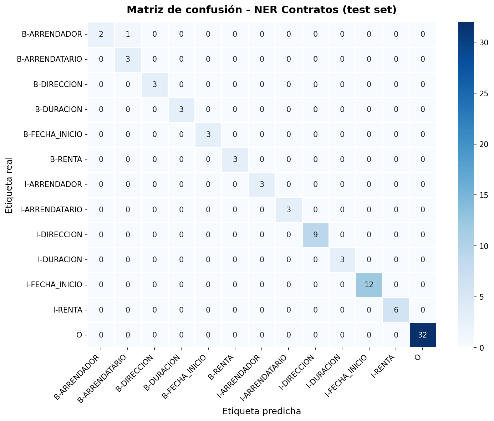

## Fase 1: Comprensión y Datos

### El problema

- **Contexto:** Un despacho de abogados digitaliza contratos de alquiler antiguos 
y necesita extraer información clave de forma automática.
- **Tarea de representación:** Identificar y extraer entidades clave de contratos
de arrendamiento (arrendador, arrendatario, renta, dirección, fecha de inicio, duración).
- **Tarea de generación:** Generar automáticamente borradores de nuevos contratos 
a partir de las entidades extraídas.

### Mini-EDA

Hemos observado que los datos presentan un claro desbalanceo esperado y natural: 
la etiqueta `O` es mayoritaria con 230 ocurrencias, mientras que las etiquetas de 
entidad están equilibradas entre sí con aproximadamente 20 ocurrencias cada una...

La longitud típica de los contratos es de 28.6 tokens de media, con un mínimo de 
26 y un máximo de 36 tokens.

Dado que todos los ejemplos se encuentran en un rango de 26-36 tokens, elegimos 
`max_length = 64` para el fine-tuning del encoder.

### Datos

Dataset sintético de 20 contratos de arrendamiento anotados manualmente en formato 
BIO, creado por el equipo al no existir ningún corpus público específico disponible.

[Enlace al dataset en Google Drive](https://drive.google.com/drive/folders/1_IzoQoUOitCbsqY2nYoDOnkL01EzxYjl?dmr=1&ec=wgc-drive-globalnav-goto)

---
 
## Fase 2: Modelos y Experimentos
 
### Modelo de Representación — Encoder (NER)
 
**Modelo elegido: `dccuchile/bert-base-spanish-wwm-uncased`**
 
Lo elegimos porque está pre-entrenado exclusivamente en texto en español (Wikipedia, noticias, libros), lo que le da una ventaja directa sobre BERT multilingüe a la hora de entender contratos en castellano. Con 110M de parámetros es manejable sin GPU de alta gama y ha demostrado rendimiento sólido en tareas NER del Spanish NLP Benchmark.
 
**Comparativa con alternativas probadas:**
 
Para intentar mejorar el F1 en ARRENDADOR probamos una alternativa más potente:
 
| Modelo | F1 global | Errores | Observación |
|--------|-----------|---------|-------------|
| `dccuchile/bert-base-spanish-wwm-uncased` (baseline) | 0.84 | 2 | Confunde ARRENDADOR↔ARRENDATARIO |
| `bertin-project/bertin-roberta-base-spanish` | 0.69 | 17 | Clasifica todos los nombres como O |
| `dccuchile/bert-base-spanish-wwm-uncased` + prefijo | **0.92** | **1** |**Mejor resultado**|
 
RoBERTa/BERTIN rindió peor porque con solo 20 ejemplos un modelo más grande no tiene datos suficientes para ajustar sus pesos adicionales. BERT base, al ser más compacto, generaliza mejor en datasets pequeños. La mejora final se consiguió añadiendo un prefijo `"Contrato :"` al inicio de cada frase, evitando que el primer nombre aparezca sin contexto previo.
 
**Métrica principal: F1-score por entidad**
 
Usamos **F1-score** (con la librería `seqeval`, que evalúa a nivel de span completo) en lugar de accuracy porque:
 
1. La mayoría de tokens en un contrato son etiquetados como `O` (sin entidad), lo que inflaría artificialmente un accuracy simple.
2. F1 penaliza igual los falsos positivos y los falsos negativos, lo que es crítico en un contexto legal donde perder el nombre del arrendatario o la renta tiene consecuencias reales.
**Resultados en test:**
 
| Entidad        | Precision | Recall | F1     |
|----------------|-----------|--------|--------|
| ARRENDADOR     | 0.67      | 0.67   | 0.67   |
| ARRENDATARIO   | 0.75      | 1.00   | 0.86   |
| DIRECCION      | 1.00      | 1.00   | 1.00   |
| DURACION       | 1.00      | 1.00   | 1.00   |
| FECHA_INICIO   | 1.00      | 1.00   | 1.00   |
| RENTA          | 1.00      | 1.00   | 1.00   |
| **GLOBAL**     | **0.90**  | **0.94** | **0.92** |
 
*Evaluado con seqeval sobre 3 contratos de test (86 tokens). Solo 1 error en total.*
 
**Matriz de confusión:**
 

 
**Análisis rápido de errores:**
 
El modelo comete únicamente **1 error** sobre 86 tokens: confunde `B-ARRENDADOR` con `B-ARRENDATARIO` en el ejemplo 1, posición 0. Es el error estructuralmente más difícil de eliminar: ambas entidades son semánticamente casi idénticas (nombre + apellido de persona) y en esa posición el modelo no dispone de contexto previo suficiente para distinguirlas. Las 4 entidades restantes (DIRECCION, DURACION, FECHA_INICIO, RENTA) se identifican con F1 perfecto de 1.00. Para eliminar este último error sería necesario ampliar el corpus, no cambiar el modelo.

---

## Fase 4: Limitaciones y Mejoras
 
### Limitaciones del Encoder (Lucas)
 
**Sesgo detectado**
El corpus cubre correctamente el caso de uso principal: contratos de alquiler residencial entre particulares. Como consecuencia natural de esta especialización, el modelo está optimizado para ese perfil y podría no generalizar igual de bien ante casos menos frecuentes como arrendadores que sean sociedades mercantiles (ej. "Inmobiliaria García S.L."), o fechas en formato numérico (01/01/2024). No es un fallo del dataset sino el reflejo esperado de entrenar un modelo especializado: gana en precisión dentro del dominio a costa de cobertura fuera de él.
 
**Limitación técnica**
El único error persistente del modelo (ARRENDADOR confundido con ARRENDATARIO en posición inicial) refleja una limitación fundamental de la arquitectura encoder: BERT construye representaciones contextuales bidireccionales, pero cuando una entidad aparece en la primera posición de la secuencia dispone de menos contexto izquierdo que el resto. Con solo 14 ejemplos de entrenamiento el modelo no ha visto suficientes variaciones sintácticas para aprender a distinguir ambos roles sin esa señal contextual. Una mejora concreta sería usar RAG (Recuperación Aumentada) para inyectar en el prompt fragmentos del contrato donde el rol de cada parte queda explícito antes de la extracción.
 
**Escalabilidad**
El pipeline completo ejecutándose en CPU tarda aproximadamente 2-3 segundos por contrato en la fase de inferencia. Para un despacho de abogados que procese cientos de contratos al día esto sería inviable. Las vías de mejora serían: desplegar el modelo en GPU (reducción a ~200ms por contrato), aplicar cuantización INT8 para reducir el tamaño del modelo a la mitad sin pérdida significativa de F1, o destilar el modelo en una versión más pequeña tipo DistilBERT para entornos con recursos limitados.
 
